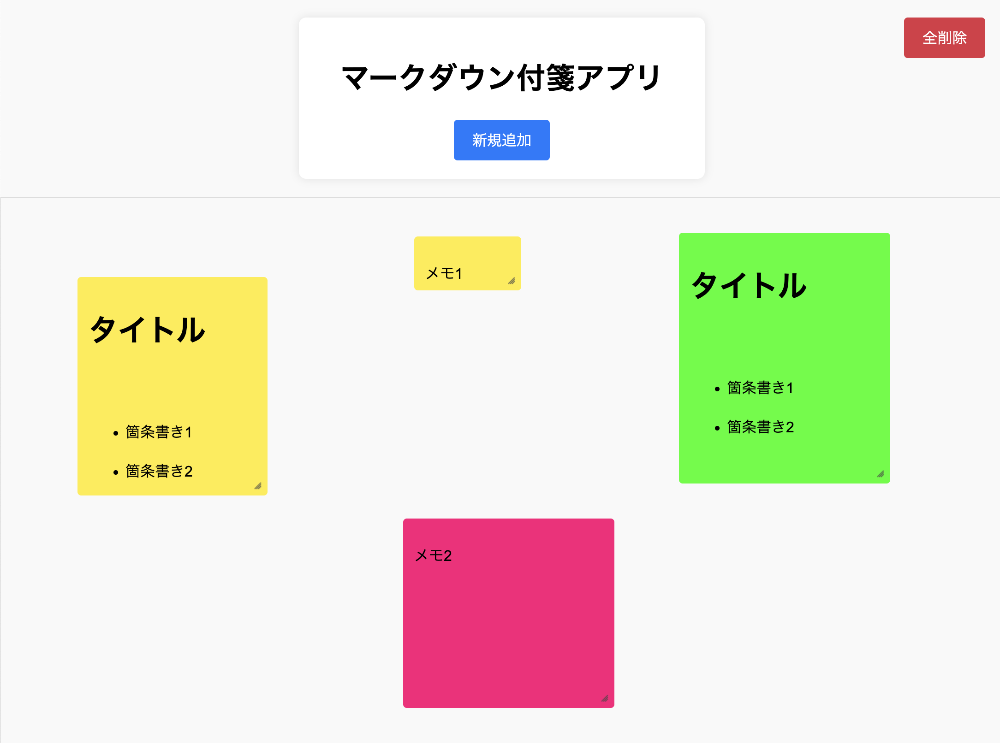

# ①課題番号-プロダクト名

マークダウン付箋アプリ

## ②課題内容（どんな作品か）

### マークダウン記法を使って画面上の付箋にメモができるアプリ

- 新規追加を押すと、付箋が画面上に配置される
- 付箋の中には、マークダウン記法でメモを記述 → 保存すると、記述内容がHTMLに変換されて表示される
- 付箋は、ドラッグによる位置変更・サイズ変更が可能
- 付箋の内容を編集・削除・背景色指定（色コード）が可能
- ダブルクリックで付箋の文章をコピーできるモードに遷移（通常時はドラッグで場所移動するモード）

## ③DEMO

https://tech-ryu.sakura.ne.jp/memo-app/markdown-husen/

## ④作ったアプリケーション用のIDまたはPasswordがある場合

- ID: なし
- PW: なし

## ⑤工夫した点・こだわった点

- マークダウン記法を使ってメモを記述できるようにした
  - markedというライブラリを使い、マークダウンのテキストからHTMLへの変換を簡単に実現
- 相対位置で各付箋にボタンを配置し、付箋ごとに操作ができるようにした
  - 付箋の中にボタンを配置することで、付箋の操作が直感的にできるようになった
- ドラッグによる付箋の位置変更・サイズ変更など高度な機能を実装
  - CSSのオプションを指定するだけでドラッグによる操作が可能になるなど、実現方法は意外と簡単だった
- 生成AIを活用して、機能を示すコメントを後から一括で追加

## ⑥難しかった点・次回トライしたいこと(又は機能)

### 難しかった点

- 前回に引き続き、背景画像の設定は難しかった
  - ボタンのサイズの指定や、画像のサイズに合わせた背景画像の設定がうまくいかなかった
  - 1つ修正すると他に影響が出てしまう、という繰り返しになりスタイルの設定はやはり難しい
- 要素のサイズ変更に他を追従させるところ

### 次回トライしたいこと

- GUI上でマークダウンのフォント設定を指定できる機能などの追加（Githubのコメント入力欄のようなイメージ）
- 画像を埋め込める機能の追加
  
## ⑦質問・疑問・感想、シェアしたいこと等なんでも

- [質問]
- [感想]
  - ドラッグによって各要素を操作するようなアプリは難しいと思っていたが、CSSの設定のみで実現できるところも多く、思ったよりは簡単に実装できたと思う
  - あとからHTML（画面上）に要素を追加していく方法を学ぶことができたので、今後の開発にも生かせそう
- [参考記事]
  - [marked (マークダウンHTML生成)](https://github.com/markedjs/marked)